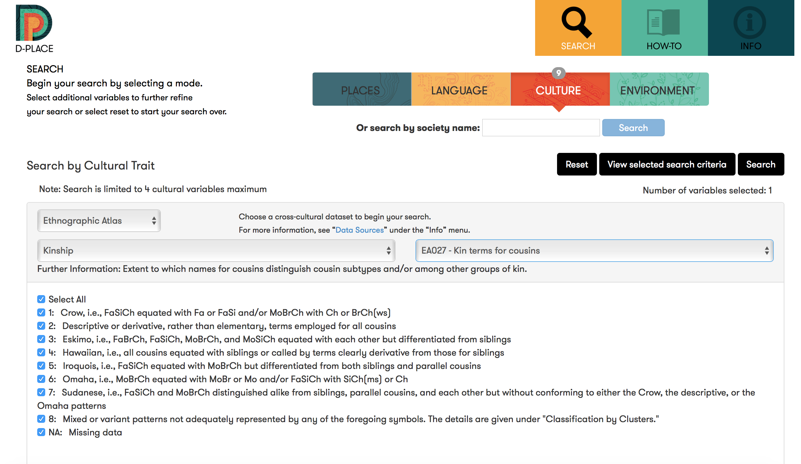
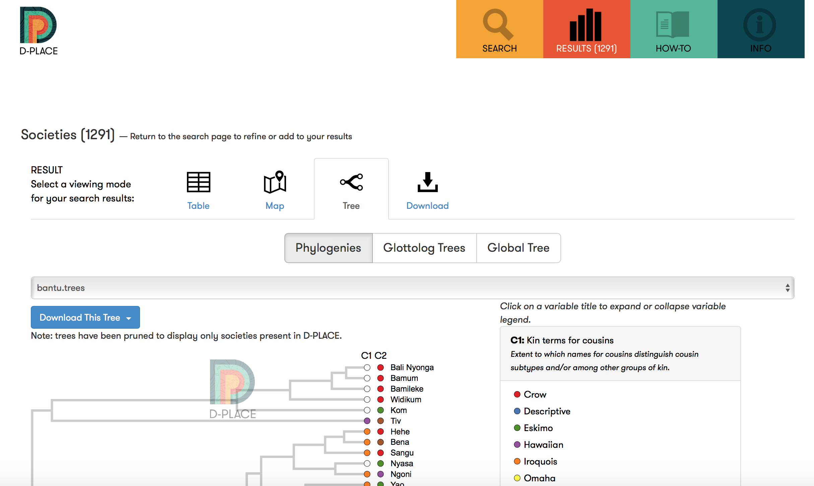

```{r setup, echo = FALSE}
knitr::opts_chunk$set(message = FALSE)
```

excdr was created to make the workflow of common tasks within the lab easier. 

The current functions are designed to make the flow from [D-PLACE](d-place.org)  to analysing the data in BayesTraits, and then reviewing the results in R. Which will be run through in the example below:

# Example: 

### Scene setting
Imagine you are writing a PhD thesis and you have just read George Murdock's book _Social Structure_. In this book, he hypothesises that the type of descent used in a society predicts which terminology they use, and offers chi-squared tests as support for his claim. 

Chi-squared test make the fatal assumption of independence between data points, so you wonder if this hypothesis would hold up under phylogenetically controlled analysis. You think maybe testing whether these two trait co-evolve is the best way to determine whether Murdock's hypothesis is true or not. 

### Get the data

You venture to [D-PLACE](d-place.org) to find some data. You select the variables EA027: kin-terms for cousins as a proxy for Murdock's terminology typology and EA043: major descent type to show descent. Then download the data as a CSV file. 

<br><br>


<br><br>

To test for correlated evolution, you need a phylogeny. You decide to test this hypothesis on Austronesian, Bantu and Uto-Aztecan families, but before you run the analysis for all these language families, you decide to ensure it works on one first. So you download a phylogeny for Bantu from D-PLACE. 

<br><br>



<br><br>

Now that you have the data you need you move into R for analysis

### Getting data into R

First, you read in the downloaded CSV file into R and have a look at it. Below is the first six rows of the data.frame (and first three columns just to fit it on one page)

```{r}
kinterm_df = read.csv('dplace-societies-2017-08-11.csv', skip = 1, stringsAsFactors = FALSE)

head(kinterm_df[,1:3])
```

Followed by you phylogeny 

```{r phylo, fig.height=20, message=FALSE}
library(geiger)

phylo = read.nexus('bantu.trees-d-place.NEXUS')

plot(phylo)
```

Oh dear. There are `r nrow(kinterm_df)` rows in your data frame but only `r length(phylo$tip.label)` taxa in your phylogeny. What's going on? 

You realise that the csv file you downloaded has _all_ the data of descent, but the Bantu family are only a small subset of that csv. How can I get the right subset? 

Not only that, but you realise that the taxa labels on your phylogeny aren't the same as the society labels from D-PLACE. What a mess! How can I pair these two data sources together with nothing to link them!? 

Fear no more as `excdr` is here to help! 

First off you need to install `excdr`. Since this package is not held on CRAN, you need to download it straight from Github. To do this you will also need to install `devtools`. 

```{r download_excdr, eval=FALSE}
install.package('devtools')
library(devtools)

install_github('SamPassmore/excdr')
```

Once you've installed the packages we can use the `pair_dplace` function to pair our D-PLACE data with our phylogeny! 

```{r pair}
library(excdr)

paired_df = pair_dplace(tree = phylo,
                        csv = kinterm_df, 
                        family = 'bantu')

```

The `pair_dplace` function returns a list object with two items

- `phy`: which contains a tree pruned to the data seen in the csv files
- `data`: which contains the data subset to the taxa seen in the phylogeny.

Let's revist our data and phylogeny!

```{r paired_results, fig.height=20, message=FALSE}
head(paired_df$data[,1:3])

plot(paired_df$phy)
```

Great! Now we have our data all organized and ready for analysis! 

### Analyzing the data

First we should have a look at some summary statistics in our data. 

Since the Description column is the easiest way to identify each data-point, but the descriptions are quite long, you also make some new variables to help with this step.

```{r summary}
# take the first 6 characters of the description for kin-terms
paired_df$data$Description..EA027.Kin.terms.for.cousins_short = 
  substr(paired_df$data$Description..EA027.Kin.terms.for.cousins, 1, 6)

# take the first 6 characters of the description for Descent
paired_df$data$Description..EA043.Descent..major.type_short = 
  substr(paired_df$data$Description..EA043.Descent..major.type, 1, 6)

t = table(paired_df$data$Description..EA027.Kin.terms.for.cousins_short,
          paired_df$data$Description..EA043.Descent..major.type_short) %>%
  addmargins(., 1:2)

knitr::kable(t)
```

This table reveals that most societies use matrilineal or patrilineal descent (aka unilineal descent), and mostly use Iroquois type terminology (or the data is missing). 

The correlated evolution between unilineal descent and Iroquois terminology seems like a sensible hypothesis to test and aligns with Murdock's theorems. So you create variables that will enable you to test this hypothesis.

```{r new_vars}
# Code 1 for Iroquois and 0 for anything else
paired_df$data$iroquois = ifelse(
  is.na(paired_df$data$Code..EA027.Kin.terms.for.cousins), NA, ifelse( # keep NA values as NA
  paired_df$data$Code..EA027.Kin.terms.for.cousins == 5, 1, 0 # 5 is the code for Iroquois
))

# Code 1 for Matrilineal or Patrilineal and 0 for anything else
# There are no missing values for this variable
paired_df$data$unilineal = ifelse(
  paired_df$data$Code..EA043.Descent..major.type %in% c(1, 3), 1, 0
)

```

Because you are an ace researcher you use the best methods - even if they aren't available in R. To test for co-evolution you hear BayesTraits is the way to go. 

But BayesTraits takes a very specific input that is not the same as the data you organized in R. 
**Oh no! Another hurdle!**

Looking further into excdr you see there is a `write.bayestraits` function that answers all your problems! 

```{r write_bt}

write.bayestraits(tree = paired_df$phy,
                  data = paired_df$data,
                  variables = c("iroquois", "unilineal"))

```


This function creates two files, one is a nexus format tree file (with the suffix .bttrees) and the other a tab-delimited text file holding that data for each taxa (with the suffix .btdata). It also converts missing data to a '-', which is the code for missing data within BayesTraits, or removes them. These files are saved in the current working directory (or specified directory). See `?write.bayestraits` for more detailed info

Let's have a look at our tree file!

```{r engine='bash', comment=''}
head -10 'iroquois-unilineal.bttrees'
```

And now the data!

```{r engine='bash', comment=''}
head -10 'iroquois-unilineal.btdata'
```


Now we all the data ready to test out the hypothesis! Let's send it to BayesTraits! 

I created the following _basic_ script to test co-evolutionary test in a Maximum Likelihood setting. This script performs two tests, one with independent evolution and one with dependent evolution

```{r engine='bash', comment=''}
cat 'co-evolutionary-script.sh'
```

We can run this script from within R using the following commands:

```{r system, echo = FALSE, eval=FALSE}
system('./co-evolutionary-script.sh ./iroquois-unilineal.bttrees ./iroquois-unilineal.btdata')
```

Hurray! We have got some results from BayesTraits! Since we ran a dependent and independent test we have two output files. These are saved as \*-dep.Log.txt for the dependent test and \*-indep.Log.txt for the independent test. Both are created in the current working directory!

Now the data we had been working with was a single phylogeny, but we can apply these functions to multiple phylogenies by utilizing the `lapply` function within R. 

For the remainder of this example, we will pretend that we created a data set with 1000 phylogenies! 

### Reviewing the results

Now we want to read in the output from our BayesTraits analysis for some visualization and post-hoc tests in R. So let's open the result! 

```{r engine='bash', comment=''}
head -40 'iroquois-unilineal-dep.Log.txt'
```

Urgh. UG-LY! How am I supposed to turn this file into something that R can deal with and let me make nice figures and images?

`excdr` is here to save the day again! 

Now we can use the 'read.bayestraits` file to get this jumbled file into R in a nice dataframe. 

```{r read}
indep = read.bayestraits('iroquois-unilineal-1000-indep.Log.txt')
dep = read.bayestraits('iroquois-unilineal-1000-dep.Log.txt')

head(indep)
head(dep)
```

Now we want to test our hypothesis! Does Unilineal descent co-evolve with an Iroquois terminology? 

Since we have maximum likelihood estimates, we should perform a maximum likelihood test! 

`excdr` can't help us here, so we define our own likelihood test function:

```{r LLR}
llr_test <- function(dep, indp, alpha = 0.05){
  lh = cbind(dep$Lh, indp$Lh)
  
  llr = apply(lh, 1, function(x) 2 * (max(x) - min(x)))
  p = pchisq(llr, ncol(dep) - ncol(indp), lower.tail = FALSE)
  results = matrix(c(mean(llr), sd(llr), mean(p), sd(p)), ncol = 2)
  dimnames(results) = list(c("mean", "sd"), c("LLR", "P-value"))
  
  bonferroni_level = alpha / nrow(dep)
  
  colnames(lh) = c("dep", "indp")
  list(Lh = lh, results = results, bonferroni = bonferroni_level)
}

result = llr_test(dep, indep)

result$results
result$bonferroni %>%
  format(., scientific = FALSE)

```

It looks like Unilineal descent and Iroquois terminologies show no signs of co-evolving. Even without a Bonferroni correction. Perhaps we need to look into finding more cousin terminologies for the missing data #l'histoiredelafamillegabonaisesaveme

# Summary

Great! We have completed our journey with excdr going from D-PLACE data to getting ready for BayesTraits, and reading in the results for BayesTraits for further testing.

## What is next for excdr? 

I see excdr as a package that anyone in the lab can contribute to, particularly for things that lots of people will doing and stop us re-creating the same function in different forms throughout the lab. 

_Does anyone have any functions they want to add? Or suggestions for useful functions?_

D-PLACE data has recently been released on GitHub, this seems like a good opportunity to create a package that downloads the data direct to R and by-pass all the clicking and saving files that make the `pair_dplace` function necessary. However I think this would be more useful in it's own package. 

## Extra functions:

LLR test paired tests of for independant & Dependant


